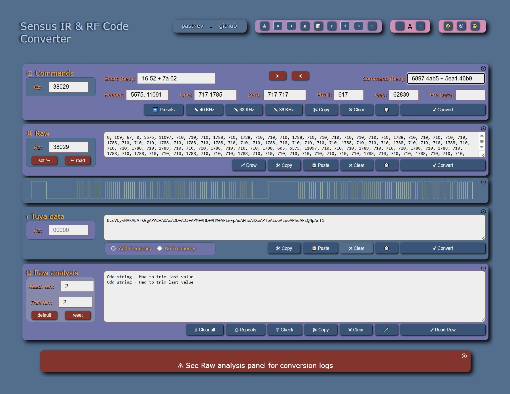
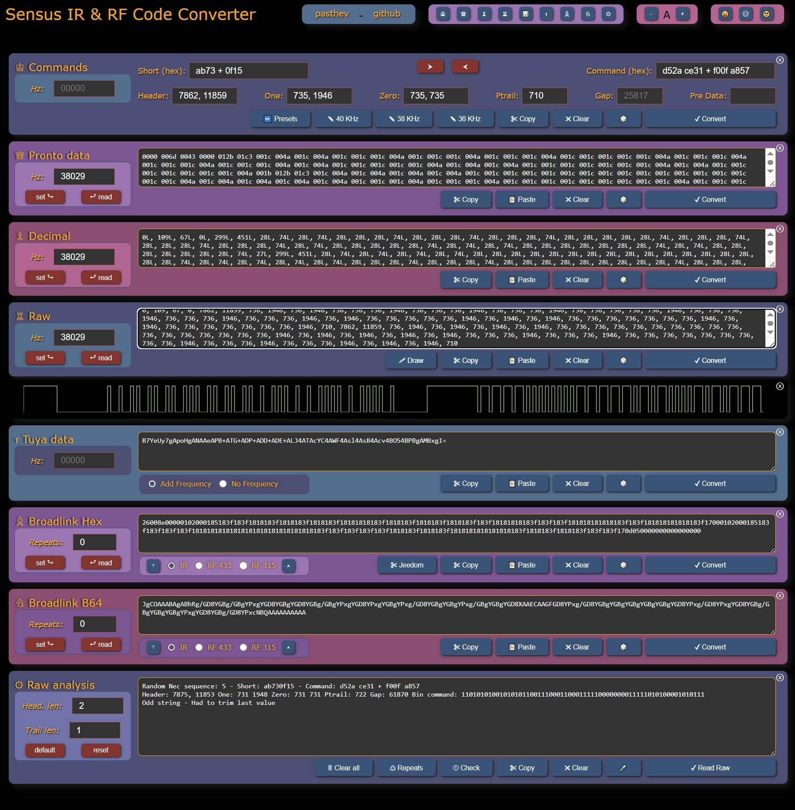
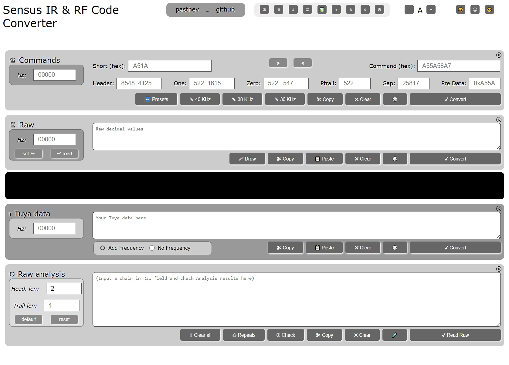

# sensus IR & RF codes converter / analyzer for Lirc, Pronto, Broadlink, Tuya, & raw codes with Impulses visualization

  <a href="https://pasthev.github.io/sensus/" style="font-size: 2em; font-weight: bold; display: block; margin-top: 0.5em; margin-bottom: 0.5em;">☞ View & Use Sensus Online</a>

    

---
Sensus is an online IR/RF code converting interface and framework.
The tool doesn't do as much as dedicated software (i.e. IRscrutinizer), but has the
advantage of being instantly available online.
Interface is easy to update with additional panels if needed - feel free to fork and
add your own protocols.

Short "thank you", positive or negative feedback always appreciated: use the [Discussions](https://github.com/pasthev/sensus/discussions) link above or this [anonymous contact form](https://docs.google.com/forms/d/e/1FAIpQLSckf2f04hYhTN3T6GvchbxhjhKcYHLMRDXnrRfqlM_eRW_NiA/viewform?usp=sf_link)

Bugs or Feature request? Us the [Issues](https://github.com/pasthev/sensus/issues) link.

---

## What Sensus IR & RF does

### Code conversion to and from:
* Lirc codes
* Pronto
* Graphic impulses
* Decimal
* Raw
* Broadlink hex (used in Jeedom)
* Broadlink Base 64 (Used in Home Assistant)
* Tuya Base 64

### Frequency change
* Read or change frequency in Lirc / Pronto / Decimal / Raw frames
* Read or change IR / RF433 / RF315 in Brodalink Hex or Base 64 code

### Broadlink repeats change
* Read or change Broadlink repeats in Hex or B64

### Tuya conversion
* Many thanks to [@mildsunrise](https://gist.github.com/mildsunrise/1d576669b63a260d2cff35fda63ec0b5) who provided a Python solution for encoding Tuya sequences.

### Random IR / RF codes generation:
* Independant random codes generation in various formats
* Broadlink random codes generation, in Hex or B64 format:
  * Allows to pre-set Repeat values
  * Allows to pre-set Signal type (IR / RF433 / RF315)

### IR/RF frames analysis
* Frames decoding in detailled logged view
* Identification of Nec5 and One-Hot encoded payloads
* Identification of original Lirc command and possible manufacturer's code from raw frame
* Cleanup and re-generation of learnt IR/RF packets

### Impulses visualization
* Note that by default, the signal drawing is trimmed from its header since it is usually not physically sent, but rather an instruction for the device on how to send this sequence. As a convenience, clicking the *Draw* button within the Raw panel will force-display this header in the graphic representation.
* Note that if the sequence contains an odd number of signals, the last value will be trimmed in the graphic representation. This is to avoid the usually long trailer that has little interest, and would have the effect of changing the scale of the actual signal represented.

---

    

  
## Notes
### Code conversion to and from:
* Some values are slightly changed during conversion or frequency set. I.e. setting Header as "2512, 5520" in Commands panel, then converting to and back from Pronto results in Header becoming "2524, 5522"
  * this is intended, and due to the way values have to be stored in the various formats. In the example above, the converted "2524, 5522" header will remain stable no matter which format it is converted to.

### Frequency change
* Changing frequency in Pronto and Decimal panels only changes frequency info packet and not actual payload values:
  * this is intended, since both changing frequency and converting timecodes in payload would lead to the exact same result as changing nothing - same spirit as 2x(14 days) = 4x(1 week). For this reason, the only place where changing frequency will actually lead to a payload conversion is the Raw panel.
  
### Random IR / RF codes generation:  
* Broadlink random functions generate One-Hot sequences, mostly used for RF signals, while other random functions generate Nec sequences, usualy designed for IR signals. This should fit most use, but you can rely on the Convert functions if you need to swap these defaults, i.e.:  
  * To get a random Broadlink IR (Nec) sequence, generate a random Raw, then convert to Broadlink.  
  * To get a random Pronto RF (One-Hot) sequence, generate a random Broadlink, and convert to Pronto.

### IR/RF frames analysis
* The *Raw* Analysis panel acts both as a log window when needed, and as a raw analyzer through functions described below. Since this analysis is performed on the content of the Raw panel, all other formats must first be converted to Raw before running any of these analysis:
  * **Read raw**: Checks raw data for a binary sequence, and tries to decompose the signal. If succesful, result will be pushed to the *Command* panel.
    * *Header length* and *Trailer length* values define the number of beginning and ending values to force-ignore. These values are updated upon completion of the *Read Raw* function. 
  * **Check**: A simple feature throwing some info about the content of the *Raw* panel, which can be useful when analyzing an unknown signal. I.e. copy a long binary string, and *Check* function will count bits, convert values to decimal and hex, invert bits, etc. Copy a series of values, and *Check* function will count these values, search for repeat strings, etc.
  * **Repeats**: A strange and sometimes useful feature that will identify and remove the last occurrence of the longest repeated string found in *Raw* panel.
  
---

## About the code

*There are many other IR/RF standards that I just ignored here: so far I only added the ones I was facing, during my experiments with Home Assistant and Jeedom domotic solutions... But the html/css interface I'm providing makes it easy to add panels for other protocols, and the code should be documented enough for anyone to easily add components of their own, as well as new buttons to the Raw analysis interface when needed.*
 
*Both the Js, css and html code can certainly be improved. Happy to learn, so, forks welcome.*
*

    

