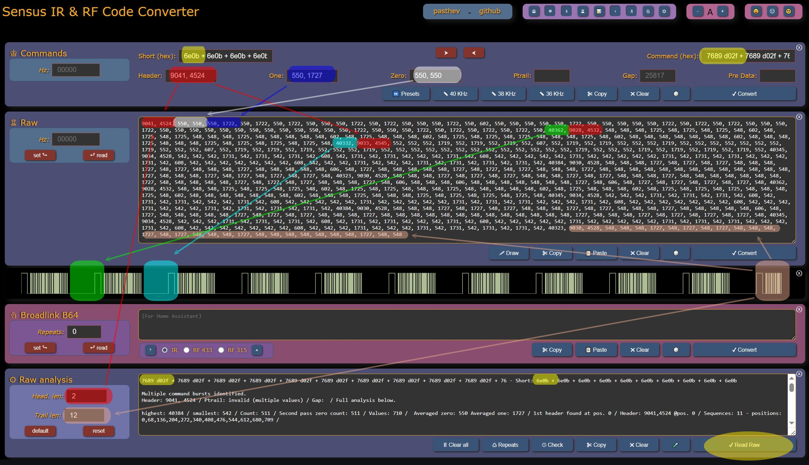
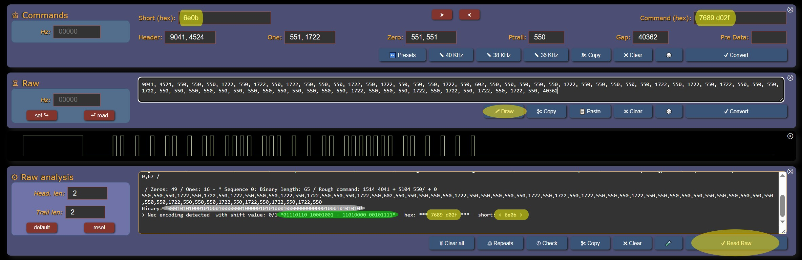
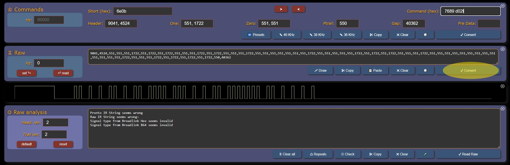
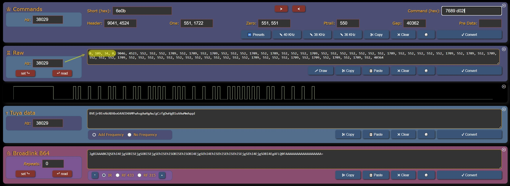

# Sensus - Guide d'utilisation

Thèmes abordés dans ce guide :
* Utilisation du convertisseur de codes IR et RF **_[Sensus](https://pasthev.github.io/sensus/)_** pour Pronto, LIRC, Tuya, Broadlink, Raw...
* Analyse d'une trame IR capturée 
* Suppression de répétitions dans une séquence IR ou RF
* Explication du protocole NEC
* Conversion de LIRC, ou commandes courtes (*Short Codes*), en code Broadlink, Tuya, Pronto et autres
* Rappels sur les fonctions de *Sensus*
---
Bon, je vais commencer cette documentation de la pire des manières, avec une série de chiffres qui pique les yeux, alors j'ajoute une image pour égayer le tout...


Voilà un exemple de Raw affreux, dans lequel le signal a été enregistré tel que reçu de multiples fois (aussi longtemps que l'utilisateur a appuyé sur le bouton durant l'apprentissage), et interrompu en cours de route :
```
9041, 4524, 550, 550, 550, 1722, 550, 1722, 550, 1722, 550, 550, 550, 1722, 550, 1722, 550, 550, 550, 1722, 550, 602, 550, 550, 550, 550, 550, 1722, 550, 550, 550, 550, 550, 1722, 550, 1722, 550, 1722, 550, 550, 550, 1722, 550, 550, 550, 550, 550, 550, 550, 550, 550, 550, 550, 550, 550, 1722, 550, 550, 550, 1722, 550, 1722, 550, 1722, 550, 1722, 550, 40362, 9028, 4532, 548, 548, 548, 1725, 548, 1725, 548, 1725, 548, 602, 548, 1725, 548, 1725, 548, 548, 548, 1725, 548, 548, 548, 548, 548, 602, 548, 1725, 548, 548, 548, 602, 548, 1725, 548, 1725, 548, 1725, 548, 548, 548, 1725, 548, 602, 548, 548, 548, 548, 548, 548, 548, 602, 548, 548, 548, 1725, 548, 548, 548, 1725, 548, 1725, 548, 1725, 548, 1725, 548, 40332, 9033, 4545, 552, 552, 552, 1719, 552, 1719, 552, 1719, 552, 607, 552, 1719, 552, 1719, 552, 552, 552, 1719, 552, 552, 552, 552, 552, 552, 552, 1719, 552, 552, 552, 607, 552, 1719, 552, 1719, 552, 1719, 552, 552, 552, 1719, 552, 552, 552, 552, 552, 552, 552, 552, 552, 552, 552, 552, 552, 1719, 552, 552, 552, 1719, 552, 1719, 552, 1719, 552, 1719, 552, 40345, 9034, 4528, 542, 542, 542, 1731, 542, 1731, 542, 1731, 542, 608, 542, 1731, 542, 1731, 542, 542, 542, 1731, 542, 608, 542, 542, 542, 542, 542, 1731, 542, 542, 542, 542, 542, 1731, 542, 1731, 542, 1731, 542, 542, 542, 1731, 542, 608, 542, 542, 542, 542, 542, 542, 542, 608, 542, 542, 542, 1731, 542, 542, 542, 1731, 542, 1731, 542, 1731, 542, 1731, 542, 40384, 9030, 4528, 548, 548, 548, 1727, 548, 1727, 548, 1727, 548, 548, 548, 1727, 548, 1727, 548, 548, 548, 1727, 548, 548, 548, 548, 548, 606, 548, 1727, 548, 548, 548, 548, 548, 1727, 548, 1727, 548, 1727, 548, 548, 548, 1727, 548, 548, 548, 548, 548, 548, 548, 548, 548, 548, 548, 548, 548, 1727, 548, 548, 548, 1727, 548, 1727, 548, 1727, 548, 1727, 548, 40323, 9030, 4528, 548, 548, 548, 1727, 548, 1727, 548, 1727, 548, 548, 548, 1727, 548, 1727, 548, 548, 548, 1727, 548, 548, 548, 548, 548, 548, 548, 1727, 548, 548, 548, 548, 548, 1727, 548, 1727, 548, 1727, 548, 548, 548, 1727, 548, 606, 548, 548, 548, 606, 548, 548, 548, 548, 548, 548, 548, 1727, 548, 606, 548, 1727, 548, 1727, 548, 1727, 548, 1727, 548, 40362, 9028, 4532, 548, 548, 548, 1725, 548, 1725, 548, 1725, 548, 602, 548, 1725, 548, 1725, 548, 548, 548, 1725, 548, 548, 548, 548, 548, 602, 548, 1725, 548, 548, 548, 602, 548, 1725, 548, 1725, 548, 1725, 548, 548, 548, 1725, 548, 602, 548, 548, 548, 548, 548, 548, 548, 602, 548, 548, 548, 1725, 548, 548, 548, 1725, 548, 1725, 548, 1725, 548, 1725, 548, 40345, 9034, 4528, 542, 542, 542, 1731, 542, 1731, 542, 1731, 542, 608, 542, 1731, 542, 1731, 542, 542, 542, 1731, 542, 608, 542, 542, 542, 542, 542, 1731, 542, 542, 542, 542, 542, 1731, 542, 1731, 542, 1731, 542, 542, 542, 1731, 542, 608, 542, 542, 542, 542, 542, 542, 542, 608, 542, 542, 542, 1731, 542, 542, 542, 1731, 542, 1731, 542, 1731, 542, 1731, 542, 40384, 9030, 4528, 548, 548, 548, 1727, 548, 1727, 548, 1727, 548, 548, 548, 1727, 548, 1727, 548, 548, 548, 1727, 548, 548, 548, 548, 548, 606, 548, 1727, 548, 548, 548, 548, 548, 1727, 548, 1727, 548, 1727, 548, 548, 548, 1727, 548, 548, 548, 548, 548, 548, 548, 548, 548, 548, 548, 548, 548, 1727, 548, 548, 548, 1727, 548, 1727, 548, 1727, 548, 1727, 548, 40345, 9034, 4528, 542, 542, 542, 1731, 542, 1731, 542, 1731, 542, 608, 542, 1731, 542, 1731, 542, 542, 542, 1731, 542, 608, 542, 542, 542, 542, 542, 1731, 542, 542, 542, 542, 542, 1731, 542, 1731, 542, 1731, 542, 542, 542, 1731, 542, 608, 542, 542, 542, 542, 542, 542, 542, 608, 542, 542, 542, 1731, 542, 542, 542, 1731, 542, 1731, 542, 1731, 542, 1731, 542, 40323, 9030, 4528, 548, 548, 548, 1727, 548, 1727, 548, 1727, 548, 548, 548, 1727, 548, 1727, 548, 548, 548, 1727, 548, 548, 548, 548, 548, 548, 548, 1727, 548, 548
```
Copiez-le, puis collez ces valeurs dans le champ *Raw* de *Sensus*.
* Fermez les panneaux de l'interface pour ne garder que ceux dont vous avez besoin - vous pourrez toujours les rouvrir à l'aide de la barre d'outils violette en haut à droite.
* Ne cliquez pas sur convertir pour l'instant, mais dans le panneau "Raw Analysis", cliquez "Read Raw" :
* Le signal est dessiné, avec ses multiples répétitions. On voit qu'il est répété dix fois, avec une queue de signal inachevé.



La commande est affichée, surlignée ici en jaune : `7689 d02f`.

* Manifestement, celle-ci est encodée en suivant le protocole NEC, puisque le programme a pu en déduire le "*short*" : `6e0b`. C'est ici du NEC Standard, avec l'adresse sur un seul octet, il faut y lire : "*Envoie au périphérique n°6e la commande 0b*", soit, en décimal : "*Envoie au périphérique n°110 la commande 11*".

* L'entête ("**Header**", ici en rouge), a été identifié : `9041, 4524`. Un haut long, suivi d'un bas de la moitié de sa longueur - standard aussi.

* Le **Zéro** (en blanc) et le **Un** (Bleu foncé) ont été calculés à leurs valeurs moyennes, respectivement `550, 550`, et `550, 1727` (la deuxième valeur pour encoder le *Un* est le triple de la première, c'est là encore un standard courant).

* Tant qu'on garde un bouton de télécommande appuyé, celle-ci renvoie le signal, mais en marquant chaque fois une pause entre deux, le "**Repeat Signal**", qui est en général le même que le signal de fin de séquence, le "**Gap**". Celui-ci vaut souvent la somme de la totalité du signal. J'ai ici indiqué le premier *Repeat* en vert, le second en bleu ciel : `40362`, et `40332`. La valeur devrait plutôt être autour des 54004 ici, mais peu importe : l'essentiel est d'envoyer un long blanc, et les durées sont exprimées en μs - on parle donc ici d'une pause de 0,4 ou 0,5 secondes.
  * Sensus n'a pas enregistré cette valeur en tant que "**Gap**" dans le champ du haut : il se méfie, car le *Gap* est attendu en fin de signal, mais peut-être devrais-je le rendre moins méfiant, car on utilisera plus tard cette valeur de repeat en tant que *Gap*.

* Le "**Ptrail**" est un court "*demi Zéro*" envoyé après la commande, juste avant le *Repeat* ou le *Gap*. Il sert à indiquer la longueur d'unité, et à rendre paire la suite de valeur, pour s'assurer que le Gap soit interprété comme un silence. Le Ptrail n'a pas été ici repéré par Sensus, je ne sais pas pourquoi - peut-être à cause de la queue inachevée - , mais il le sera en temps utiles.


## Supprimer les répétitions

Nous avons tout ce qu'il nous faut pour, au choix, nettoyer la séquence, ou la re-générer à partir des valeurs identifiées dans le panneau "**Commands**" - les valeurs manquantes étant ``Ptrail : 550`` (un demi Zéro), et ``Gap : 40350`` (ou ``54554``, soit la somme des valeurs de la commande, dont on exclue le *Ptrail*, si l'on veut un équilibrage parfait)

### Nettoyage :

La méthode est simple. On commence par supprimer du Raw toutes les valeurs après le premier Repeat (qui deviendra ainsi notre *Gap* de fin de séquence). Cela ne laisse dans le champ Raw que la séquence suivante :

```
9041, 4524, 550, 550, 550, 1722, 550, 1722, 550, 1722, 550, 550, 550, 1722, 550, 1722, 550, 550, 550, 1722, 550, 602, 550, 550, 550, 550, 550, 1722, 550, 550, 550, 550, 550, 1722, 550, 1722, 550, 1722, 550, 550, 550, 1722, 550, 550, 550, 550, 550, 550, 550, 550, 550, 550, 550, 550, 550, 1722, 550, 550, 550, 1722, 550, 1722, 550, 1722, 550, 1722, 550, 40362
```

Faites-le, puis cliquez de nouveau dans le panneau "**Raw Analysis**" sur "**Read Raw**". Dans le panneau "**Raw**", cliquez sur "**Draw**". Vous voilà avec un signal propre, une commande et un short uniques, qui ont bien les mêmes valeurs que celles initialement répétées :



* Notez que cette fois, le **Ptrail** et le **Gap** sont identifiés : `550`et `40362`. 
* Tel quel, le signal a toutes les chances de fonctionner, mais notez que dans certains standards imposant un équilibrage, `403622` devrait être remplacé par `54004`, soit la somme des valeurs du signal. Mais puisque c'est la valeur `40350`qui a été enregistrée, autant la conserver.

Ajoutez ce chiffre à la main dans Raw, puis cliquez sur "**Draw**" : le signal s'affiche, avec son Gap, prêt à être converti dans le format désiré.

## Interlude : histoires de bits
Avant de voir l'autre méthode de nettoyage, un coup d'oeil à Raw Analysis. En défilant tout en bas de l'analyse, on peut voir ces valeurs :
```
Binary: *00010101000101000100000001000001010100010000000000000100010101010*
> Nec encoding detected  with shift value: 0/1 *01110110 10001001 + 11010000 00101111* - hex: *** 7689 d02f *** - short: < 6e0b > 
```

Explication :

La ligne "*Binary*" affiche les valeurs Raw converties bêtement en 0 et en 1
La ligne "*with shift value*" lit ces bits (les "**bibits**") deux par deux, ici encodés 00=0 & 01=1, ce qui n'est pas toujours le cas.
La ligne  "*hex*" affiche ces valeurs en hexadécimal: 01110110 en binaire s'écrit 76 en héxadécimal, ou 110 en décimal. 
```
  550,  550,  550, 1722,  550, 1722,  550, 1722,  550,  550,  550, 1722,  550, 1722,  550,  550,  550, 1722,  550,  602...
   0     0     0     1     0     1     0     1     0     0     0     1     0     1     0     0     0     1     0     0...
|     0     |     1     |     1     |     1     |     0     |     1     |     1     |     0     |     1     |     0     |...
|                                             HEX 76                                            |                  HEX 89...
```

Lecture de la commande "**Short**" dans la séquence NEC `7689 d02f` :

`550` et `1722` sont des durées d'impulsions et de silence à émettre. Cela signifie qu'envoyer ici un `0` demande `550+550=1100 μs` et un `1`, `550+1722=2272μs`, soit plus du double.

De fait, envoyer `11111111` prendrait, à cette échelle minuscule, beaucoup plus de temps qu'émettre `00000000`, et l'interprétation de signaux à durées variables serait moins précise, et sujette à des erreurs d'interprétation.

La solution ? Envoyer chaque fois une valeur et son inverse binaire. Ainsi, la longueur du signal devient constante, et l'on a une valeur de relecture pour vérification de la bonne réception.

Ainsi, si l'on considère la séquence émise :
```
01110110 10001001 + 11010000 00101111
```

Mises l'une au-dessus de l'autre, les valeurs sont bien des inverses :
```
01110110 - 11010000 
10001001 - 00101111
```

Le contrôle étant concluant, on vire la deuxième ligne, pour ne prendre que la première :
```
01110110 - 11010000
```

Ces deux octets sont encodés en LSB First, c'est à dire le valeur la moins signifiante en premier. On retourne chacun horizontalement : 
```
01110110 - 11010000
01101110 - 00001011
```
soit `6e - 0b`

Cette commande est dans le seul format généralement communiqué par les fabricants - lorsqu'ils les communiquent. C'est aussi ce format qu'utilise **LIRC**, et l'on trouve de nombreuses bases de données en ligne, comme la [LIRC Remotes Databases](https://lirc-remotes.sourceforge.net/remotes-table.html).

Ainsi, si l'on en parcoure cette [table LIRC](https://lirc-remotes.sourceforge.net/remotes-table.html) et que l'on clique par exemple [	samsung/0070-63.lircd.conf](https://sourceforge.net/p/lirc-remotes/code/ci/master/tree/remotes/samsung/0070-63.lircd.conf), on redécouvre toutes les valeurs qui ont été abordées ici.

Les "**Shorts**" sont dans la catégorie begin codes :
```
begin codes :
          KEY_POWER                0x00000000000040BF        #  Was: Power
          D.Trk                    0x000000000000847B
          Input                    0x00000000000024DB
          KEY_KPPLUS               0x000000000000649B        #  Was: +
          KEY_KPMINUS              0x00000000000014EB        #  Was: -
```
`0x` indique une notation hexadécimale, et tous les 00 à gauche sont aussi utiles que de dire "*j'ai froid, il fait 000000015° dans mon séjour !* : on les supprime, et l'on découvre ainsi que pour allumer cette TV Samsung, il faut lui envoyer le short code `40bf`.
* Au besoin, Sensus permet de rapidement convertir un *Short* en commande, et vice-versa : ce n'est pas utile ici, mais entrez le *Short* en haut à gauche, cliquez la flèche qui part vers la droite, vous obtiendrer le résultat de l'inversion et de la conversion LSB en haut à droite : `02fd fd02` pour `40bf`.

La page LIRC contient les infos à entrer dans le panneau "Commandes" de Sensus :

```
  header       4635  4332
  one           656  1562
  zero          656   445
  ptrail        656
  pre_data_bits   16
  pre_data       0xA0A0
  gap          47917
  toggle_bit      0
```
Là où tout cela devient vraiment intéressant pour la domotique, c'est qu'en cherchant, on peut trouver sur le Web les fameux codes secrets, les "**Discrete Codes**", qui contiennent des séquences que la TV par exemple peut reconnaître, alors qu'il n'y a pas de bouton équivalent sur la télécommande.

Par exemple, pour ma TV (oui, j'ai une vieille TV, je suis un peu technophobe):
```
begin remote

  name  Samsung_BN59-00937A
  bits            16
  flags    SPACE_ENC|CONST_LENGTH
  eps             30
  aeps           100
  header        4605  4344
  one            678  1551
  zero           678   436
  ptrail         679
  pre_data_bits   16
  pre_data    0xE0E0
  gap         107626
  toggle_bit_mask 0x0

      begin codes
          TV1_Power                0x40BF                    #  Was: Power
          TV1_PowerOff             0x19E6                    #  Was: Power Off
          TV1_PowerOn              0x9966                    #  Was: Power On
          TV1_VolumeUp             0xE01F                    #  Was: Vol+
```
`40BF`, c'est le bouton qui fonctionne en bascule On/Off sur ma télécommande. Mais si je veux programmer Jeedom ou Home-Assistant pour une extinction à distance ou un allumage automatisé via mon émetteur IR Tuya, Broadlink ou autre, j'emets `19E6`, je suis sûr de l'éteindre, et avec `9966`, je peux bien envoyer deux fois le code par mégarde, la TV restera allumée.

Fort de tout cela, revenons-en à notre signal initial. Nous avons vu comment le "nettoyer", mais puisqu'on en a extrait tout ce que nous voulions savoir - l'équivalent des infos LIRC - nous pouvons le générer à partir de ces infos que nous avons récupérées dans le panneau *Commands* :
```
  header        9041, 4524
  one            551, 1722
  zero           551, 551
  ptrail         550
  gap          45000

  Code "Short"  6e0b
```

## Générer une séquence d'après les infos *LIRC*
Il ne reste plus qu'à entrer ces valeurs dans le panneau *Commands* de *Sensus*, et à cliquer sur "**Convert**" dans le panneau de Commandes.



### Quelques points à savoir:
* Lorsque vous entrez un Raw dans Sensus et cliquez sur Convert, les valeurs du Raw sont ajustées pour une compatibilité maximale avec les autres protocoles. Ces changement de quelques microsecondes n'affecteront pas votre signal, qu'il soit IR ou RF.

* Dès lors qu'une fréquence est saisie, elle est affichée encodée dans le Raw, sous forme d'un en-tête de quatre valeurs : les deux premières contiennent la fréquence, les suivantes le nombre de valeurs de commandes de la séquence. Celles-ci ne servent pas à grand chose dans un Raw, mais elles n'affectent pas le signal émis. Notez au passage que j'ai choisi par défaut d'exclure ces valeurs inutiles de l'affichage graphique lorsqu'on clique sur "Convert". Mais j'ai programmé le bouton "Draw" pour que lui l'affiche, si vous voulez voir le signal exact.


* Pour indiquer la fréquence en Hertz, vous pouvez au choix:
  * Cliquer le bouton de la fréquence voulue dans le panneau *Commands*.
  * La saisir directement dans le champ correspondant.
  * Une flèche blanche apparait dans le champ lorsqu'il est vide, donnant accès à un menu déroulant avec les fréquences courantes.




**[Pasthev 2025](https://pasthev.github.io/)**

---
_Feedback / Questions / Petit merci : Utilisez le lien [Discussions](https://github.com/pasthev/sensus/discussions) ci-dessus, ou contactez-moi via mon [formulaire de contact anonyme](https://docs.google.com/forms/d/e/1FAIpQLSckf2f04hYhTN3T6GvchbxhjhKcYHLMRDXnrRfqlM_eRW_NiA/viewform?usp=sf_link)_